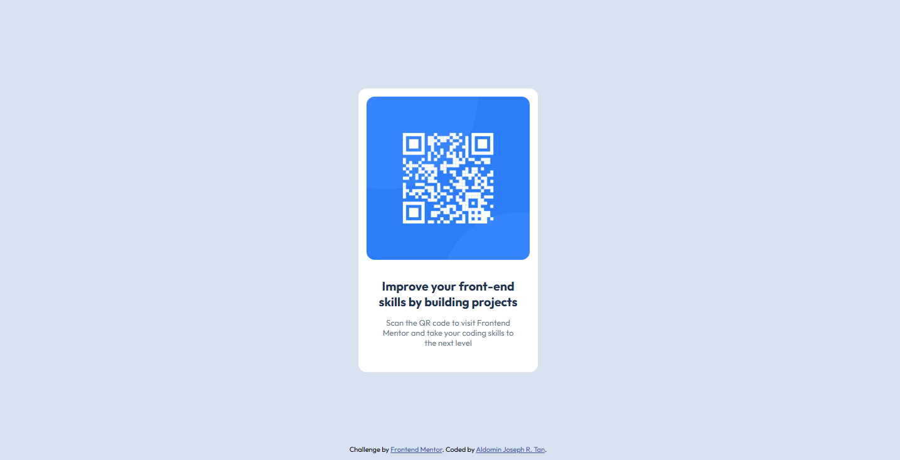

# Frontend Mentor - QR code component solution

This is a solution to the [QR code component challenge on Frontend Mentor](https://www.frontendmentor.io/challenges/qr-code-component-iux_sIO_H). Frontend Mentor challenges help you improve your coding skills by building realistic projects.

## Table of contents

- [Overview](#overview)
  - [Screenshot](#screenshot)
  - [Links](#links)
- [My process](#my-process)
  - [Built with](#built-with)
  - [What I learned](#what-i-learned)
- [Author](#author)

**Note: Delete this note and update the table of contents based on what sections you keep.**

## Overview

### Screenshot




### Links

- Solution URL: [https://github.com/AJ-Tan/1.-Frontend-Mentor---QR-Code.git]
- Live Site URL: [https://aj-tan.github.io/1.-Frontend-Mentor---QR-Code/]

## My process

### Built with

- Semantic HTML5 markup
- CSS custom properties
- CSS Grid

### What I learned

By using rem for text sizes, width, spaces, paddings, and margins made adjustments to cater mobile devices much easier by simply changing the font-size in root.

```css
:root {
  --white: hsl(0, 0%, 100%);
  --slate-300: hsl(212, 45%, 89%);
  --slate-500: hsl(216, 15%, 48%);
  --slate-900: hsl(218, 44%, 22%);

  font-size: 13px;

  --space-xs: 0.75rem;
  --space-sm: 1rem;
  --space-md: 1.5rem;
  --space-lg: 2rem;
  --space-xl: 4rem;
}

@media screen and (width <= 375px) {
  :root {
    font-size: 15px;
  }
}
```

## Author

- Frontend Mentor - [@@AJ-Tan](https://www.frontendmentor.io/profile/AJ-Tan)
